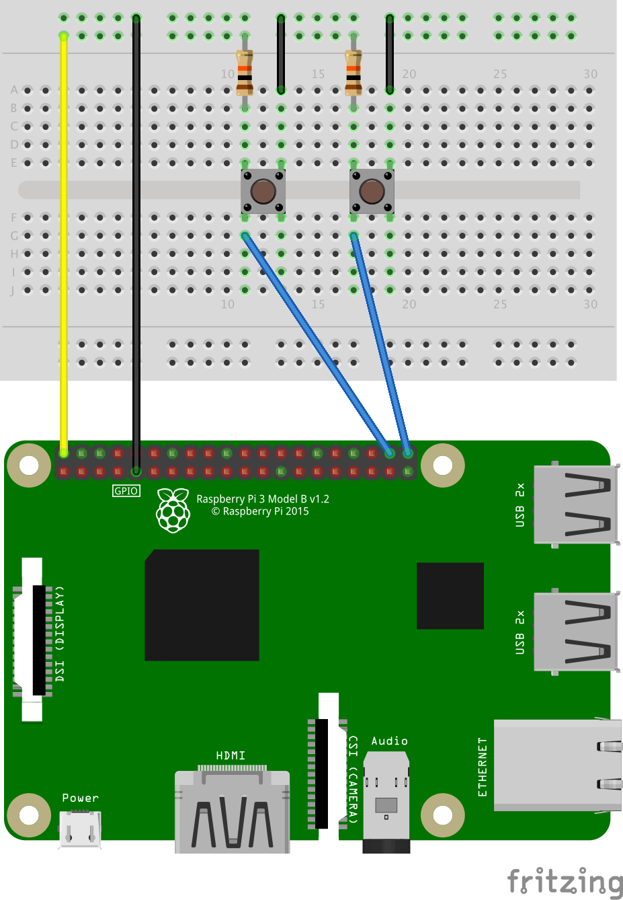

# pin-board
pin-board is Pinterest client for Android.

## Setup
You have to do some things to build project.
- Prepare Pinterest apps
  1. Create pinterest apps from https://developers.pinterest.com/apps/
- `secrets.properties` file
  1. Create `secrets.properties` file and place it under project directory
  2. Set value
     ```
     PINTEREST_API_CLIENT_ID=your_pinterest_api_client_id
     ```
- Firebase
  1. Create Firebase project
  2. Create two apps onto the project  
     These package names are `com.r21nomi.pinboard` and `com.r21nomi.pinboard.debug`
  3. Download `google-services.json` and place it under app directory
  4. Fix database rules  
     WARNING: This settings has no security.  
     This should be used for development.
  ```
  {
      "rules": {
          ".read": true,
          ".write": true
      }
  }
  ```

## Setup for Android Things
You have to setup hardware to build `things` module.
  1. See https://developer.android.com/things/hardware/developer-kits.html
  2. Wiring  
  

## License
```
Copyright 2017 Ryota Takemoto (r21nomi)

Licensed under the Apache License, Version 2.0 (the "License");
you may not use this file except in compliance with the License.
You may obtain a copy of the License at

http://www.apache.org/licenses/LICENSE-2.0

Unless required by applicable law or agreed to in writing, software
distributed under the License is distributed on an "AS IS" BASIS,
WITHOUT WARRANTIES OR CONDITIONS OF ANY KIND, either express or implied.
See the License for the specific language governing permissions and
limitations under the License.
```
